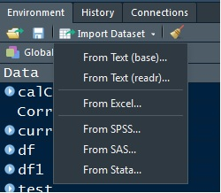

```{r setup, include=FALSE}
knitr::opts_chunk$set(echo = TRUE)
```

# Operaciones aritméticas

Para introducirnos al uso del editor y de la linea de comandos de Rstudio, empezaremos con unas operaciones muy básica

```{r operaciones}

2 + 2

5 - 3

3 * 2

6 / 3

```

Es posible aplicar reglas de asociación estándar así como operaciones más allá de las básicas (potencia, logaritmo, etc.)

```{r operaciones 2}

(5 + 3) / 4

3^2

log(100, base = 10)

5 %% 3

sqrt(9)


```

# Asignación de variables

Podemos guardar *valores* asignandoles un nombre, de modo que podamos acceder a dicho valor posteriormente 

nota: esto es importante

```{r asigna}

x <- 4

x

```

```{r}

Numero_de_empleados <- 150

Numero_de_empleados

```


```{r}
Nuevos_analistas_enero <- 5

Nuevos_analistas_febrero <- 3

Analistas <- Nuevos_analistas_enero + Nuevos_analistas_febrero

Analistas

```

#Tipos básicos en R


```{r tipos}

Numero <-  1.0   # (real, flotante)
Entero <- 1      
Caracter <- "ab"   
Logico <- TRUE  

Numero
Entero
Caracter
Logico

```
 
 Tener cuidado cuando trabajamos con tipos distintos
 
```{r tipos2}

#Numero + Caracter

```
 
 Cuando realizamos una operación con dos tipos numéricos distintos (real + entero), R *forza* (coerce) a que el resultado al tipo con mayor precisión, en este caso al tipo real
 
```{r tipos3}

Suma <- Numero + Entero

Suma

class(Suma)
typeof(Suma)

```
 
 Varias cosas acá, hemos tenido nuestra primera aproximación a una función en R, tópico que exploraremos con mayor detalle más adelante. Al igual que la idea intuitiva que tenemos de función de las matemáticas de secundaria, una función en R tiene un argumento (variable entre paréntesis) y nos arroja un resultado.
 
 En R las funciones tienen su nombre seguido de paréntesis, donde colocamos la(s) variable(s) de argumento(s): `una_funcion(x)`
 
 Las funcion `class` nos indica la clase de la variable (numérico, entero o lógico)
 
 
 
 
```{r tipos4}
is.numeric(Numero)
is.integer(Entero) 
is.character(Caracter)
is.logical(Logico)
```
 
 Vemos que R nos dice que `Entero` no es un entero, para especificar un entero debemos colocar una letra L al final del número
 
```{r tipos5}
Entero_2 <- 1L
Entero_2
is.integer(Entero_2)
class(Entero_2)
typeof(Entero_2)

```
 
 

# Vectores

Vamos a utilizar R para analizar datos y crear modelos estadísticos o algorítmicos a partir de los mismos.

La mayoría de los datos vienen representados en *tablas*: hojas de cálculo, bases de datos relacionales, ficheros .csv, etc.

La mayoría de los modelos estadísticos usan como input datos en forma de tabla.

El objeto más empleado para trabajar con tablas en R son los **data frame** y demás variantes (los tibble por ejemplo).

Antes de entender como trabajar tablas, repasamos el concepto de vector, que es el tipo básico sobre el cual están construidos los data frames.

```{r vectores}

vector_numerico <- c(1, 10, 49)
vector_caracter <- c("a", "b", "c")

vector_numerico
vector_caracter

```

Los vectores son arreglos de una dimensión (fila o columna) que pueden almacenar números, carácteres o variables lógicas.

Los elementos deben ser del mismo tipo (todo números por ejemplo)

Como hemos visto arriba, los vectores se crean con el comando `c()` donde la c viene de _concatenar_

```{r vectores2}

vector_mixto <- c(1,2,"a")
vector_mixto

```

En el ejemplo anterior hemos querido crear un vector con elementos de distintos tipos, numérico y carácter. R ha convertido todos los elementos a carácter.

Si hay carácteres en un vector R convierte todos los elementos a carácter, si todos son numéricos pero de distinto tipo, R los convierte al tipo de mayor precisión (doble). ¿Qué pasa con los vectores lógicos?

```{r vectores3}

vector_mixto2 <- c(1,2,TRUE)
vector_mixto2

```

En este caso R ha convertido los elementos del vector a numérico

Observamos algo que posteriormente va a ser muy útil, R le ha asignado a la variable lógica `TRUE` el número 1. La variable `FALSE` tiene asignado un cero

¿Podemos cambiar una variable o un vector de tipo? SI

```{r vectores4}

vector_numerico

as.character(vector_numerico)

vector_logico <- c(TRUE, FALSE)

vector_logico

as.numeric(vector_logico)

```

Existen varias funciones en R que permiten realizar cambios de tipo

Existen otro par de formas de crear vectores

```{r vectores5}

vector_1 <- 1:5

vector_2 <- seq(1,5)

vector_1

vector_2


```

Donde `seq` viene de secuencia

Se pueden crear secuencias más complejas con la función `seq()`

```{r vectores6}

vector_3 <- seq(1,10, by = 2)

vector_4 <- seq(1,10, length.out = 20)

vector_5 <- seq(1,10, along.with = vector_1)

vector_3

vector_4

vector_5

```


Se pueden asignar nombres a los elementos del vector

```{r vectores7}

names(vector_1)

nombres <- c("uno", "dos", "tres", "cuatro", "cinco")

names(vector_1) <- nombres

names(vector_1)

```

Otro comando para generar secuencias es `rep`

```{r vectores8}

repetido <- rep(4,10)

repetido

```

Podemos repetir no solo un valor sino vectores

```{r vectores9}

repetido_2 <- rep(1:4, 4)

repetido_2

repetido_3 <- rep(1:4, each = 4)

repetido_3

repetido_4 <- rep(1:4, each=2, times=2)

repetido_4

repetido_5 <- rep(1:4, c(2,3,4,5))

repetido_5

```


## Matrices

Al igual que la noción intuitiva que tenemos de matemáticas, las matrices son arreglos rectangulares de datos del mismo tipo

```{r matrices}

A <- matrix(c(1, 2, 3, 4), nrow=2, ncol=2)
A


```

## Operaciones con vectores

Se pueden realizar operaciones con vectores

```{r vectores10}

vector_1

vector_2

Vec_suma <- vector_1 +vector_2

Vec_suma

```

```{r vectores11}
vector_1

vector_2

Vec_producto <- vector_1 * vector_2

Vec_producto


```

```{r vectores11_2}

vector_1

vector_cuadrado <- vector_1^2

vector_cuadrado

```

Se pueden pasar funciones a vectores

```{r vectores11_3}

vector_1

vector_raiz <- sqrt(vector_1)

vector_raiz

```


## Inspección de vectores

Es posible aplicar ciertas funciones para analizar algunas características de los vectores.

Recordar que el objetivo último es el de realizar análisis de datos, algunas de estas funciones serán empleadas de manera regular cuando querramos inspeccionar los datos de una tabla 

Longitud de un vector

```{r inspect}

vector_4

length(vector_4)

```

Estadísticos de un vector

```{r inspect1}

summary(vector_4)

```


Valores al principio y al final

```{r inspect2}

head(vector_4)

tail(vector_4)

```


Tabla de frecuencias

```{r onspect3}

table(vector_4)

```

## Selecciones

Es posible construir nuevos vectores a partir de un vector

```{r select1}

vector_1

vector_cuadrado <- vector_1^2

vector_cuadrado

```

¿Como accedemos a los elementos de un vector?

```{r select2}

vector_cuadrado[1]

vector_cuadrado[3]

```

Varios elementos seguidos (slice)

```{r select3}

vector_cuadrado[1:3]

vector_cuadrado[3:1]

```

Varios elementos no seguidos

```{r select4}

vector_cuadrado[c(1,3)]

vector_cuadrado[c(3,1)]

```

Todos los elementos excepto algunos

```{r select5}

vector_cuadrado[-c(1,3)]

vector_cuadrado[-length(vector_cuadrado)]

```

Todos los elementos que cumplan una condición

```{r select6}

vector_5

vector_5[vector_5 < 5]

vector_5[vector_5 > 5]

```

La condición puede ser una igualdad

```{r select7}

vector_5[vector_5 == 5.5]

```

Estas condiciones son muy importantes para el análisis de datos. Suponga que desea localizar en una tabla con los datos financieros de un conjunto de personas, los datos de aquellos clientes cuyo ingreso sea mayor a 30.000 al año

También es útil para localizar datos y reemplazarlos por otro valor. Siguiendo el ejemplo anterior, sustituir la columna de ingresos de los clientes cuyo ingreso anual es menor de 12.000 al año por cero, ya que no trabajaremos con ese segmento

```{r select8}

vector_5

vector_5[vector_5 < 5] <- 0

vector_5

```

En el caso que los vectores tengan nombres, podemos emplear estos para seleccionar elementos 

```{r select9}

vector_cuadrado["dos"]

vector_cuadrado[c("uno", "tres")]

```

Más funciones aplicadas a vectores

```{r select10}

vector_5 <- seq(1,10, along.with = vector_1)

vector_5

max(vector_5)

min(vector_5)

sum(vector_5)

prod(vector_5)

```


# Cosas Pendientes 

## Paquetes

Además de las funciones que vienen con R podemos instalar otros paquetes que tienen otras funciones incorporadas.

Un paquete no es más que código y/o datos que mejoran alguna funcionalidad de R o incorpora una nueva.

Para instalar un paquete solo tenemos que ejecutar `install.packages(nombre paquete)` y para usarlo lo cargamos en nuestro script con `library(nombre paquete)`.

Por lo general vamos a cargar e instalar paquetes con mucha frecuencia, ya que para muchos ejercicios estadísticos, de previsión, machine learning, etc. necesitaremos más y/o mejores funciones que las que trae el R base.

Para ver los paquetes que tenemos instalados podemos ir a la pestaña `Packages` o teclear en nuestra consola:

```{r paq, echo=TRUE, error=FALSE, warning=FALSE, results='hide'}

installed.packages()

```

Una búsqueda en google nos ayuda a buscar nuevos paquetes que nos ayuden a hacer cosas que necesitamos pero también tenemos la lista oficial de [CRAN](https://cran.r-project.org/web/packages/available_packages_by_name.html) (The Comprehensible R Archive Network) o [MetaCRAN](https://www.r-pkg.org/) que además nos ayuda a buscar los paquetes alojados en otras plataformas como GitHub.

## Directorios de trabajo

Por higiene en el trabajo ya sea profesional o académico, es recomendable fijar los directorios (dirección de la carpeta) donde vamos a trabajar

Para saber en que carpeta estamos empleamos la instrucción `getwd()`

```{r wd}

getwd()

```

```{r wd2}

setwd("c:/Users/Usuario/Documents/Mapfre/")

```

Verificamos

```{r wd3}

getwd()

```


## Factores

En R se emplea el tipo factor para representar variables catergóricas (sexo, estado civil, código postal, cargo, etc.)

Existen variables categóricas las cuales poseen *niveles*, por ejemplo si nos referimos a tamaños, mediano es mayor a pequeño y estos dos a su vez están por debajo de grande.

El tipo factor permite que podamos realizar análisis estadísticos sobre variables categóricas tengan o no niveles u ordenaciones por jerarquía.

Se crean factores usando la función `factor()`

```{r factor1}

factor(1:3)

```

Si deseamos colocar niveles al factor

```{r factor2}

factor(1:3, levels = 1:5)

```

**Nota:** Cuando aprendamos a cargar datos externos en R, los data frames transforman por defecto cualquier carácter en factor, si no deseamos que eso sea así se lo debemos indicar a R


# Data Frames

El `data.frame` será uno de los objetos que más utilizaremos en R para el análisis de datos.

Los data frames son *tablas* o arreglos rectangulares, podemos tratarlos como si fueran una hoja de Excel en la cual organizamos los datos que deseamos analizar.

Al igual que en Excel, podemos hacer cálculos con las tablas, crear nuevas columnas (variables), realizar análisis estadísticos, etc.

Una gran diferencia de R (u otros lenguajes) con Excel es que nuestro análisis puede ser reproducible, un tercero puede ver todos los pasos que hemos realizado y ser capaz de replicarlo.

## Inspeccionar los datos

Por lo general, solemos inspeccionar los datos de una tabla para familiarizarnos con ellos y ver que tipo de análisis podemos realizar con ellos.

Vamos a usar datos de seguros de coches en el Reino Unido en 1975

```{r echo=FALSE, error=FALSE, message=FALSE, warning=FALSE}
#install.packages("CASdatasets", repos = "http://cas.uqam.ca/pub/R/", type = "source")
library(CASdatasets)
data(ukaggclaim)
```

Podemos abrir una versión amigable de la tabla en RStudio

```{r df1}

View(ukaggclaim)

```

Existen varias formas de echar vistazos rápidos a los datos sin necesidad de visualizar la tabla entera

Por ejemplo podemos ver las 6 primeras filas

```{r df2}

head(ukaggclaim)

```

O las 6 últimas

```{r df3}

tail(ukaggclaim)

```

Si en lugar de 6, queremos ver un determinado número de filas, simplemente se lo decimos a las funciones `head`y `tail`

```{r df4}

head(ukaggclaim, n = 3)

tail(ukaggclaim, n = 2)

```

En ocasiones utilizamos tablas muy grandes que almacenan muchas variables, en este caso antes de visualizar aunque sea solo una fracción de la tabla, es útil ver el nombre las columnas o lo que es lo mismo, las variables

```{r df5}

colnames(ukaggclaim)

```


En general, para poder determinar cuantas variables y cuantas observaciones tenemos, usamos la función `dim`, la cual nos da el número de columnas y filas de la tabla

```{r df6}

dim(ukaggclaim)

```

Podemos ver por separado el número de filas y columnas con `nrow` y `ncol`

```{r df7}

ncol(ukaggclaim)

nrow(ukaggclaim)

```


Otra forma es usando la función `str`. Aunque no es intuitiva e incluso intimida a primera vista, no es tan complicado y aporta información útil 

```{r df8}

str(ukaggclaim)

```

Una versión que aporta información estadística es `summary`

```{r df9}

summary(ukaggclaim)

```

Existen otras versiones de `summary` fuera de R base, elaboradas por otras personas (luego hablaremos de las librerías)

Una que aporta mucho detalle es la función `describe` de la librería `psich`

```{r df10}

pacman::p_load(psych)
describe(ukaggclaim)

```

La función `skim` de la librería `skimr` también aporta más información que `summary`

```{r df11, warning=FALSE}

pacman::p_load(skimr)
skim(ukaggclaim)

```

## Selecciones

Ahora que tenemos nuestros datos en un data frame, el próximo paso es acceder a ciertos datos de la tabla (una columna o grupo de filas que cumplan una condición), manipular y crear nuevas variables.

Podemos acceder a los datos del data frame del mismo modo que lo hacíamos con los vectores, los data frames no dejan de ser una especie de conjuntos de vectores

Recordar que podíamos acceder a elementos de los vectores por posición o nombre

```{r df12}

head(ukaggclaim, n = 1)

ukaggclaim[1,2]

ukaggclaim[1,4]

```

En el primer caso le decimos a R que queremos que nos muestre el dato de la primera fila y la segunda columna, en el segundo caso el dato de la primera fila y cuarta columna

En el caso que deseemos ver una columna o fila específica, dejamos una de las dimensiones en blanco

Si queremos acceder a la información de la segunda fila

```{r df13}

ukaggclaim[2, ]

```

Si queremos acceder a la información de la cuarta columna

```{r df14}

ukaggclaim[ , 4]

```

Tambien podemos obtener la información por columna usando el nombre de la misma

```{r df15}

ukaggclaim[ , "NClaims"]

```

Asimismo, podemos inspeccionar una columna de data frame escribiendo el nombre del mismo seguido de un signo `$` y el nombre de la columna

La ventaja de este método es que los nombres de la columna se autocompletan

```{r df16}

ukaggclaim$NClaims

```

Con la posición, al igual que los vectores, podemos acceder a conjuntos de filas y columnas (slices)

Por ejemplo, si nos queremos quedar solo con las 3 primeras filas y la cuarta y quinta columna

```{r df17}

ukaggclaim[1:3, 4:5]

```

Podemos construir una tabla nueva a partir de esta sub-tabla, asignando la última a un nombre

```{r df18}

uk_peque <-  ukaggclaim[1:3, 4:5]

uk_peque

```

Sub-tabla solo con las 10 primeras filas

```{r df19}

ukaggclaim[1:10, ]

```

Sub-tabla solo con las 2 últimas columnas

```{r df20}

ukaggclaim[, 4:5]

```


Podemos seleccionar datos con criterios según cumplan una condición

```{r df21}

ukaggclaim[ukaggclaim$AvCost > 300, ]

```

```{r df22}

ukaggclaim[ukaggclaim$Model == "A", ]

```

Lo podemos complicar

```{r df23}

ukaggclaim[ukaggclaim$Model == "A" & ukaggclaim$NClaims >= 100, ]

```

Le hemos pedido a R que nos muestre los datos de la tabla que correspoden a los modelos de coches "A" y que el número de solicitudes sea mayor o igual a 100

Ambas condiciones se cumplen de manera simultanea

```{r df23_1}

ukaggclaim[ukaggclaim$Model == "A" | ukaggclaim$NClaims >= 100, ]

```


Podemos inspeccionar columnas individuales

```{r df24}

summary(ukaggclaim$AvCost)

```

```{r df25}

table(ukaggclaim$OwnerAge)

```

Algo que solemos hacer con mucha frecuencia en Excel, es ordenar una tabla por fila, esto también lo podemos hacer en R con la función `order`

```{r df26}

ukaggclaim[ order(ukaggclaim$AvCost),]

```

Hemos ordenado de menor a mayor, si quisieramos hacer lo contrario solo debemos colocar un signo menos `-` delante de la columna

```{r df27}

ukaggclaim[ order(-ukaggclaim$AvCost),]

```

Hemos observado que hay una que otra fila con valores `NA`. Este tipo de variables sirve para denotar datos que no están disponibles, _celdas vacías_ en lenguaje de excel

Si quisieramos eliminar dichas filas, usamos la función `na.omit`

```{r df28}

dim(ukaggclaim)

uk_limpio <- na.omit(ukaggclaim)

uk_limpio

dim(uk_limpio)

```

En ocasiones no deseamos eliminar las filas, sino imputar algún valor

```{r df29}

ukaggclaim$AvCost[is.na(ukaggclaim$AvCost)] <- 0

```

# Input - Output (o simplemente como cargar y guardar datos en R)

Hemos estado trabajando con variables, vectores, data frames (tablas), pero a estas alturas quizás ya nos hemos percatado que al cerrar RStudio todas estas variables se _pierden_

Para evitar esto podemos guardar los datos de diversas formas y formatos

Una opción es guardarlo como un archivo externo, por ejemplo un libro de Excel o un archivo csv

La otra opción es guardarlo como un archivo de R, al cual podamos acceder simplemente llamando la tabla o variable por su nombre

## Cargar datos de fuentes externas 

Podemos cargar datos directamente con el RStudio

 

Lo que hemos hecho antes vía menú, se ha ejecutado en R con este código

```{r io1}

pacman::p_load(readxl)
empleados <- read_excel("empleados.xls", sheet = "Resultados", na = "n.d.")

```

Recordar que podemos visualizar la tabla con `View()`

```{r io2}

View(empleados)

```

Observamos que la primera columna no es útil, la podemos eliminar facilmente, pero antes de hacerlo inspeccionemos información relativa al número de columnas

```{r io3}

head(empleados)

ncol(empleados)

colnames(empleados)

```

Antes de eliminar la columna creamos una nueva tabla igual a la original, esto se suele hacer si por alguna razón deseas conservar los datos originales


```{r io4}

empleados_2 <- empleados

```


Eliminamos la columna asignandole un valor `NULL`

```{r io5}

empleados_2$X__1 <- NULL

```

Repetimos la inspección anterior para verificar que ha sido eliminada la columna

```{r io6}

head(empleados_2)

ncol(empleados_2)

colnames(empleados_2)

```

Como se puede observar en el menú, se pueden cargar archivos de distintos formatos, otro formato común es `csv`

```{r io7}

airquality <- read.csv("airquality.csv", stringsAsFactors=FALSE)
  
View(airquality)

```

Si deseamos guardar un archivo en excel o csv lo hacemos del siguiente modo:

```{r io8}

pacman::p_load(xlsx)

aire <- airquality

write.xlsx(x =  aire, file = "aire.xlsx", row.names = FALSE)

write.csv(x = aire, file = "aire2.csv")

```

Por otro lado podemos guardar datos como un archivo `Rdata`, el cual podremos simplemente cargar posteriormente en R 

```{r io9}

save(aire, file = "aire.RData")

```

Usamos el comando `rm()` para remover del espacio de trabajo la tabla aire 

```{r io10}

rm(aire)

```

El objeto ya no existe en memoria (ver la ventana de environment), pero como ya lo hemos guardado lo podemos recuperar con el comando `load()`

```{r io11}

load(file = "aire.RData")

```

Si miramos la venta de environment observamos que hemos recuperado la tabla

```{r}

aire

```

